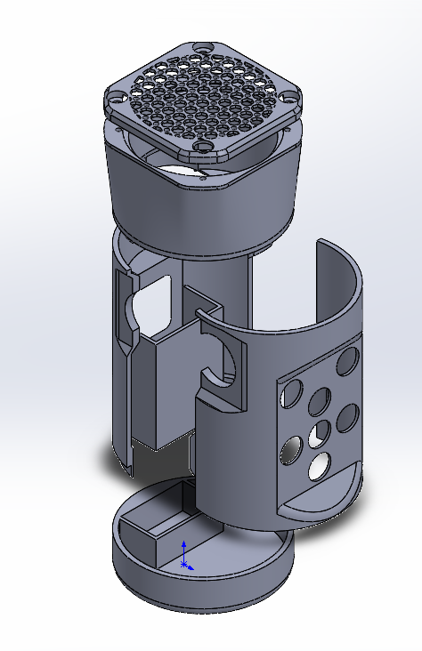
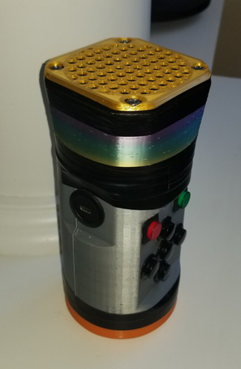

<link rel="stylesheet" type="text/css" href="/assets/css/solidworks.css">

# Below are photos of the exploded and completed views.

This is one of my most recent CAD projects. I custom designed a bluetooth speaker chassis and the circuitry to run both the speaker and bluetooth components.
This assembly required surfacing and precise component fitment.

The chassis was designed to hold two 18650 rechargeable lithium ion batteries, a bluetooth module, and a speaker. The top portion of the chassis holds the speaker and has a cutout for both mesh grating at the top and a passive radiator on the bottom. These two items ensure that the speaker sounds good and is protected against the elements.

