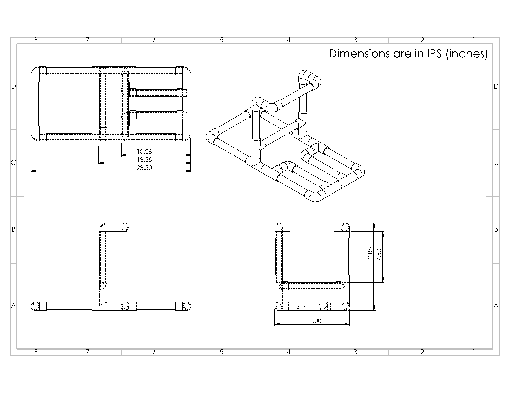

<link rel="stylesheet" type="text/css" href="/assets/css/solidworks.css">

# This is a 3D rendition of my teams 2019 TSA-Catapult entry.

Here is the finished product, that helped us place first at the state competition. This is a drawing made from a 35+ part assembly.

