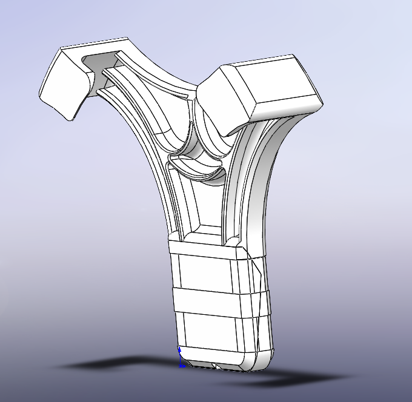
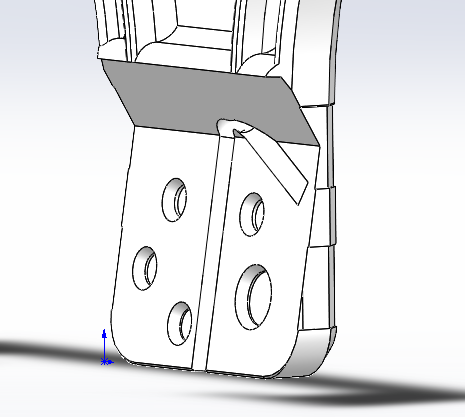
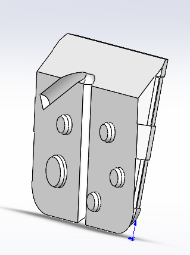
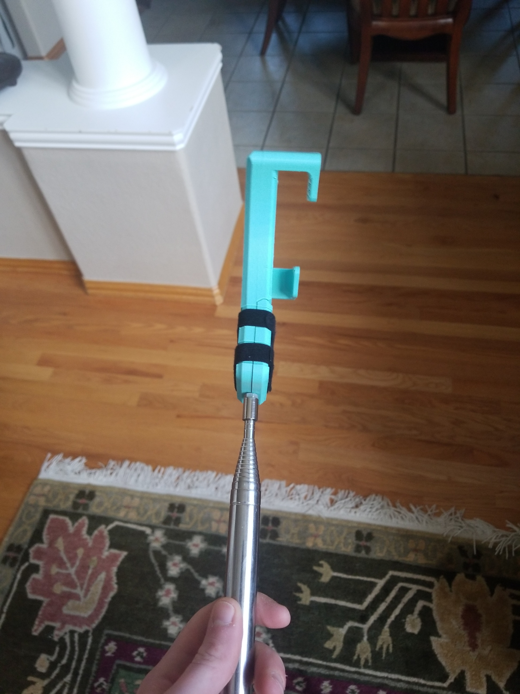
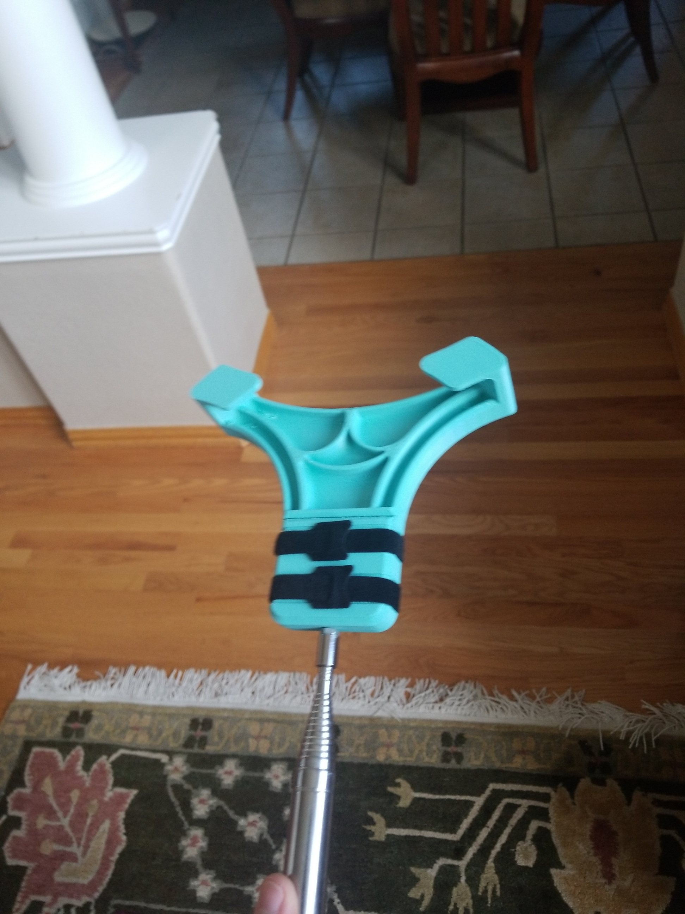

# This is an adapter I designed to form fit a Kwik-Stik Disc Golf Retriever

I took inspiration to design this adapter from a few different already existing products:

The design:

The final product:

