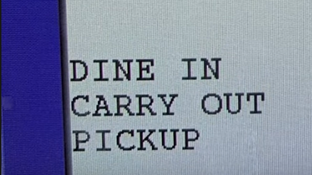
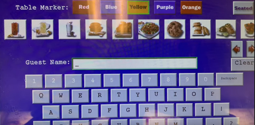
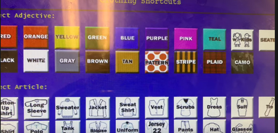
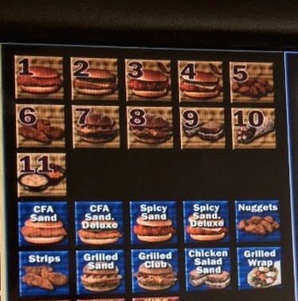
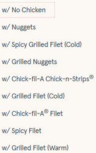
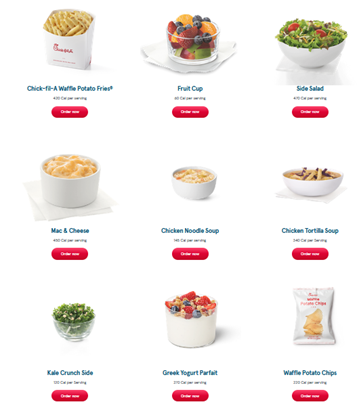
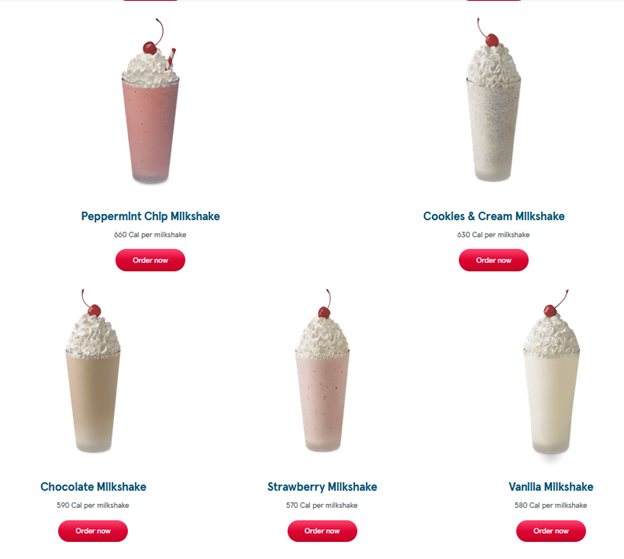

## How to Order at Chick-Fil-A

Most customers at Chick-Fil-A have never been behind the counter at the POS systems. Because of this, most customers say their order in a non-desirable order which makes it harder for new team members to take the order. Because of this disconnect from customer to POS system, a set of instructions for customers to follow would be the best option. These manuals would be shown next to the menus and or on the back of the POS systems.

The purpose of this manual is to allow our store to increase speed of order taking. This increase in speed would mean more customers would be able to get through our line faster which would end up being more profit for the franchise.

A word of caution when setting up this instruction set. Customers may get aggravated when they notice they can’t order in a non-uniform way anymore. If this is to happen, just remind them that these instructions are necessary to get them there food faster.

The manual infographic should be used to remind returning customers how to order, and the manual can be given out to new customers with their first order.

## Steps

### Location of Dining
The team member taking an order will see a screen similar to the figure 1. This will be one of first prompt that the team member sees, so it is important that the customer states if they are dining in or carrying out near the beginning of the ordering process.

 fig1

### Starting an Order
After the location of dining has been stated, the team member will most likely ask for a name. The team member will be looking at a screen similar to figure 2. A customer should state their name at this step and that is all.

 fig2

If the customer is ordering carry out, they should give the team member a little bit of time here as they will also need to enter some identifying information as shown in figure 3. This ensures that Chick-Fil-A can get the order to the correct person if multiple people with the same name are waiting for carry out.

 fig3

### Ordering Food
1.	The customer should state if their item is a meal (entre + side + water is still a meal) or entree. As shown in figure 4, there are duplicate items for the meals (with numbers) and individual entree items (in blue) on the POS system.
  * If ordering any item with cheese: specify type of cheese (American, Pepper Jack, Colby Jack).
  * If ordering a salad, make sure the type of salad is stated (options are shown in figure 5).

 fig4  fig5

### Ordering Sides
1.	This can be with a meal or as an addition to an entree
2.	Specify the size of the side (this will be medium by default if ordering with a meal)

 fig6

### Drinks*
*Items in figure 7 also count as drinks for meals
1.	Specify the size of the drink
2.	Specify the amount of ice wanted or any other modifications to the drink

 fig7

<!-- [Super Secret Link](/solidworks.md) -->
