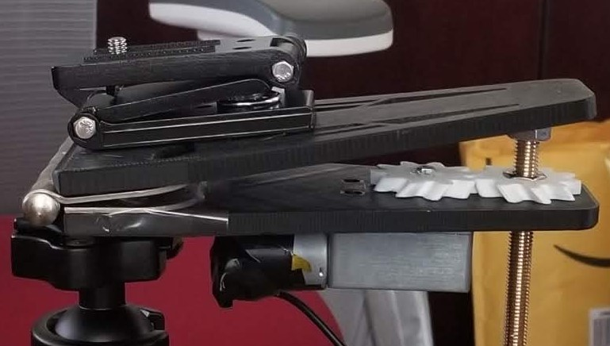
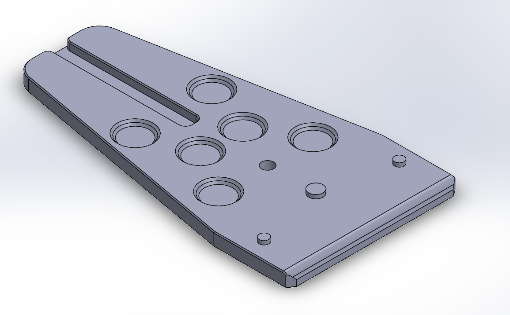
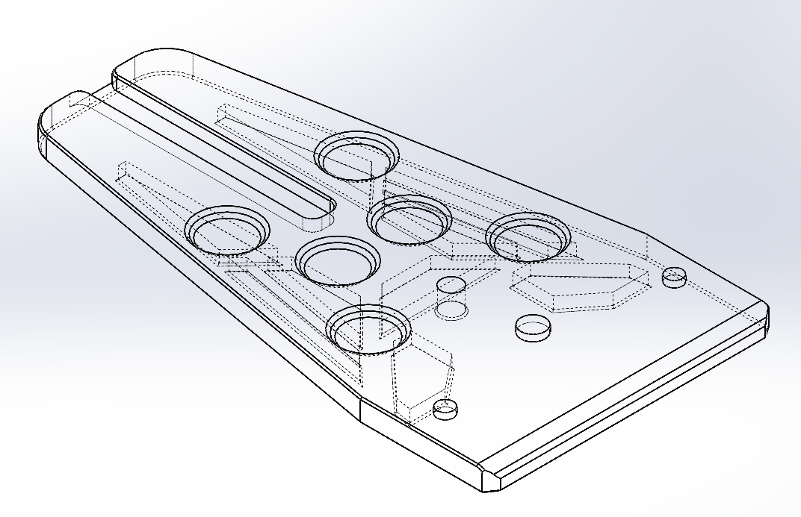
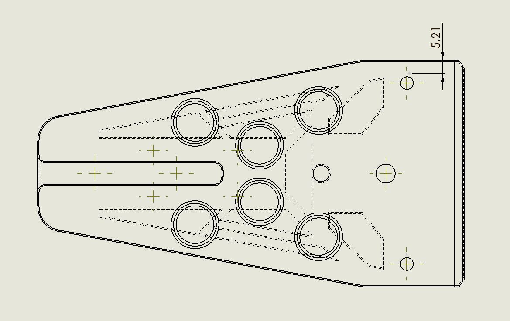
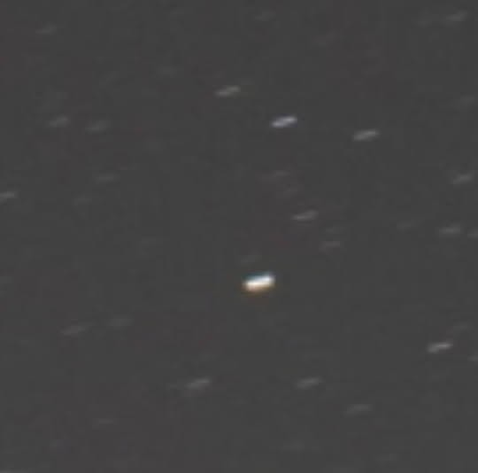
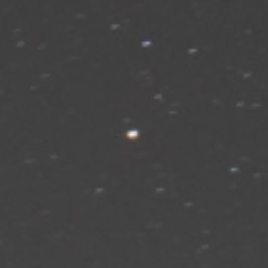
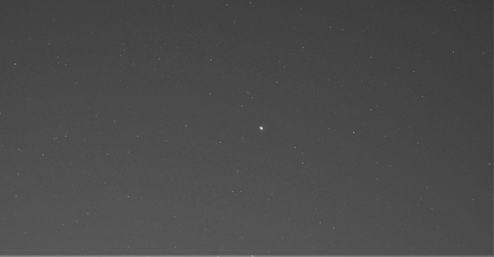
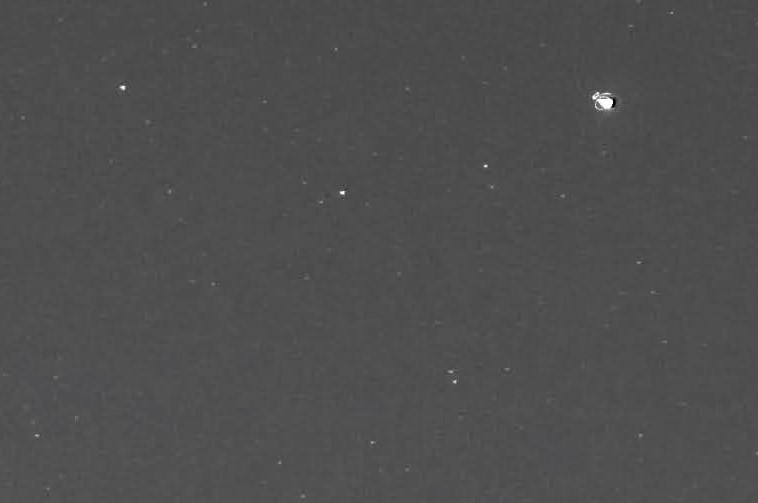

# Below are photos of the design and finished tracker/&#8203;mount.

This is one of my most recent CAD projects. I custom designed an equatorial tracker/mount that would normally cost $200+. The final design came out to around $50 including the z-plate, ball head mount, and the tracker itself.
This assembly required precise component fitment, gear calculations, and strength analysis.

# Here are some of the photos I took with the tracker.

I didn't quite align the tracker correctly, but you can still see massive improvement in the length of the star trails for a 30sec exposure time. (Before -> After)

Now for one of the better photos I have taken with the tracker still at 30sec exposure. (The image is in Black and White, so it is easer to see the star trails. Because this image was taken almost at the break of dawn, there is a lot of light in it and it is very hard to see the stars in color.)

Now zoomed in, you can see how small those star trails are!

