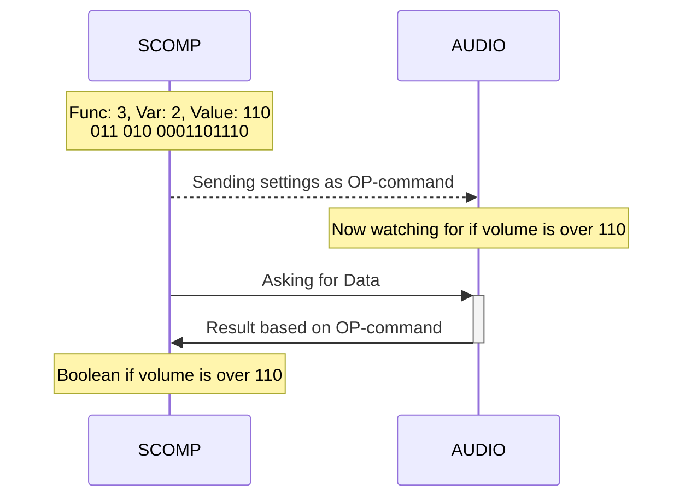
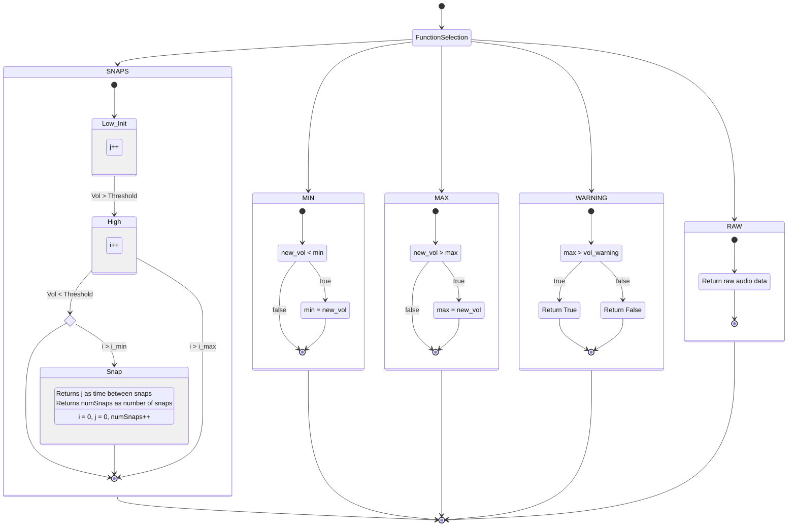

- [Assembly Helper Function and Variables](#assembly-helper-function-and-variables)
  - [Function](#function)
  - [var `SoundFunction`](#var-soundfunction)
  - [var `SoundVariable`](#var-soundvariable)
  - [var `SoundSetValue`](#var-soundsetvalue)
- [Function Setup and Call w/ SCOMP:](#function-setup-and-call-w-scomp)
  - [Communication Flow](#communication-flow)
  - [All Variables](#all-variables)
  - [Only Changing the Output](#only-changing-the-output)
- [Pheripheral Flow](#pheripheral-flow)

# Assembly Helper Function and Variables

## Function

```asm
; -----------------------------------------------
; Sound setting's variables and helper functions
; This block of code is required in your ASM file
; -----------------------------------------------
SetSoundSettings:
; Setting up the OP command
    LOAD    SoundFunction
    SHIFT   3
    ADD     SoundVariable
    SHIFT   3
    ADD     SoundSetValue
    OUT     Sound

; Cleaning up  "SoundVariable" and "SoundSetValue"
    LOADI   0
    STORE   SoundVariable
    LOADI   0
    STORE   SoundSetValue

    RETURN

SoundFunction: DW 0             ; 0-7
SoundVariable: DW 0             ; 0-7
SoundSetValue: DW 0             ; 0-1023
```

## var `SoundFunction`

This variable is used to set the output of the sound peripheral. The values that can be used are `0-7`:

| Input | Function           | Units                          |
| ----- | ------------------ | ------------------------------ |
| 0     | Number of Snaps    | #                              |
| 1     | Vol Min            | 10 (Cafe Ambient) - 220 (Clap) |
| 2     | Vol Max            | 10 (Cafe Ambient) - 220 (Clap) |
| 3     | Detect Loud Volume | Boolean                        |
| 4     | Time Between Snaps | milliseconds                   |
| 7     | Raw Audio          | 10 (Cafe Ambient) - 220 (Clap) |

## var `SoundVariable`

This variable is used to set what value is changed when tuning the peripheral. These are dependent on the `SoundFunction`. The values that can be used are `0-7`:

| Input | `Function`       | Tuning Parameter           |
| ----- | ---------------- | -------------------------- |
| 0     |                  | NO CHANGE                  |
| 1     | Num. of Snaps    | Length of Snap, MIN        |
| 2     | Num. of Snaps    | Length of Snap, MAX        |
| 3     | Num. of Snaps    | Loudness Threshold         |
| 1     | Min/Max Vol      | MIN and MAX Refresh        |
| 2     | Detect Loud Vol. | Warning Loudness Threshold |

## var `SoundSetValue`

This variable is used to set the value of the tuning parameter as selected by `SoundFunction`. Below is a table of all the units for each tuning parameter. The values that can be used are `0-1023`.

| Input  | `Tuning Parameter`  | Units or Estimations           | Default |
| ------ | ------------------- | ------------------------------ | ------- |
| 0-1023 | Length of Snap, MIN | 10's of μs                     | 125     |
| 0-1023 | Length of Snap, MAX | 10's of μs                     | 750     |
| 0-1023 | Loudness Threshold  | 10 (Cafe Ambient) - 220 (Clap) | 200     |
| 0-1023 | MIN and MAX Refresh | s                              | 1       |
| 0-1023 | Loudness Threshold  | 10 (Cafe Ambient) - 220 (Clap) | 200     |

# Function Setup and Call w/ SCOMP:

## Communication Flow



## All Variables

```asm
; -----------------------------------------------
; Function setup and call with all variables
; -----------------------------------------------
    LOADI    4
    STORE    SoundFunction
    LOADI    1
    STORE    SoundVariable
    LOADI    579
    STORE    SoundSetValue

    CALL     SetSoundSettings
```

<!-- ## Direct Value no Helper Function

```asm
; -----------------------------------------------
; If you know what the final number will be, you can also
; set settings like this.
; -----------------------------------------------
    LOADI   &B1000011001000011

    OUT     Sound
```
-->

## Only Changing the Output

```asm
; -----------------------------------------------
; If no "SoundVariable" is set, it will just change
; the output without affecting the settings.
; -----------------------------------------------
    LOADI   4
    STORE   SoundFunction

    CALL    SetSoundSettings
```

# Pheripheral Flow




